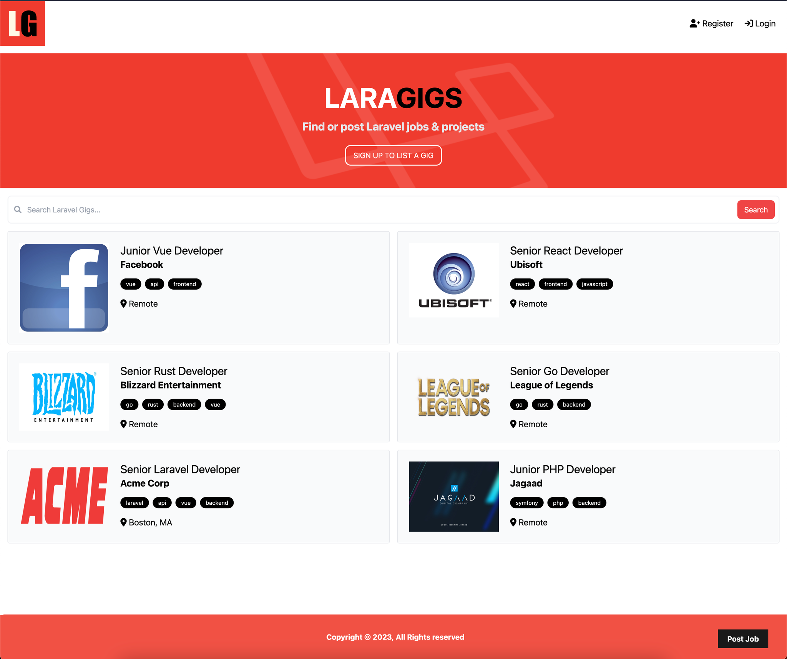

<p align="center">
  
</p>

<h1 align="center">LaraGigs</h1>

## Description

LaraGigs is an innovative web application designed to connect freelancers and gig-seekers with potential job opportunities. With a user-friendly interface and powerful search capabilities, LaraGigs aims to simplify the process of finding and applying for gigs, while providing a platform for businesses and individuals to post their job listings. Whether you're a freelancer looking for part-time work or a business seeking skilled professionals, LaraGigs is the go-to app for gig/job listings.

<p align="center">
  
</p>

# Usage

## Requirments

-   PHP 8.1
-   <a href="https://getcomposer.org/" rel="nofollow">Composer</a>
-   <a href="https://www.mamp.info/en/mamp/windows/" rel="nofollow">MAMP</a>
-   <a href="https://laravel.com/docs/10.x" rel="nofollow">Laravel</a>

## Database Setup

This app uses MySQL. To use something different, open up config/Database.php and change the default driver.

To use MySQL, make sure you install it, setup a database and then add your db credentials(database, username and password) to the .env.example file and rename it to .env

## Migrations

To create all the nessesary tables and columns, run the following

```
php artisan migrate
```

## Seeding The Database

To add the dummy listings with a single user, run the following

```
php artisan db:seed
```

## File Uploading

When uploading listing files, they go to "storage/app/public". Create a symlink with the following command to make them publicly accessible.

```
php artisan storage:link
```

## Running The App

Upload the files to your document root, Valet folder or run

```
php artisan serve
```
